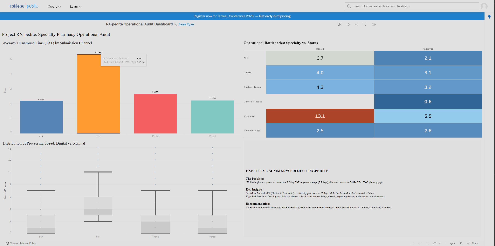

# Project RX-pedite: Specialty Pharmacy Operational Audit
### Optimizing Prior Authorization Lifecycles & Speed-to-Therapy
[](https://colab.research.google.com/github/ryansp86/Project-RX-pedite/blob/main/notebooks/Project_RX-pedite_Case_Study.ipynb)

---

> **Note on Data Ethics:** This is a **hypothetical case study** developed for a professional portfolio. All data utilized in this audit is **100% synthetic** and was engineered to simulate real-world specialty pharmacy workflows while maintaining complete data privacy. No actual Patient Health Information (PHI) or provider records were used in this analysis.

---

## Project Overview
Project RX-pedite is a diagnostic audit of the Prior Authorization (PA) lifecycle within a high-volume specialty pharmacy environment. By analyzing 10,000+ records of clinical and operational data, this study identifies the **"Fax Tax"**—a significant administrative bottleneck caused by manual workflows that delay life-altering therapy for patients.

---

## 1. Ask: The Business Challenge
**Business Task:** Identify the root causes of administrative latency in the Prior Authorization process to improve speed-to-therapy for complex clinical specialties (Rheumatology, Gastroenterology, etc.).

* **The Problem:** While the network meets its 3.0-day corporate benchmark (averaging 2.8 days), manual workflows mask a significant opportunity for "Best-in-Class" performance (<24 hours).
* **Key KPI:** Turnaround Time (TAT) variance between electronic (ePA) and manual (Fax) submission channels.

## 2. Prepare: Data Integrity & Privacy
To maintain 100% HIPAA compliance while ensuring high-fidelity clinical logic, this project utilizes a **synthetic dataset**. 

* **Scenario Foundation:** The project simulates a diagnostic audit within a national specialty pharmacy network.
* **Data Engineering:** Engineered using the **Python Faker library** to simulate real-world workflows, including provider NPIs, clinical denial reasons, and submission timestamps.
* **Privacy Assurance:** By utilizing synthetic data, this analysis demonstrates technical proficiency in handling clinical variables without accessing or compromising sensitive Patient Health Information (PHI).

## 3. Process: Data Cleaning & Standardization
The raw audit data required significant "Process" phase rigor to ensure analytical accuracy. By utilizing Python and the Pandas library, I transformed the "Chaos Monkey" dataset into a standardized, analysis-ready format.

### **Technical Implementation**
The following script was used to resolve naming fragmentation, handle missing clinical values, remove duplicate records, and standardize date formats for Tableau integration.

```python
import pandas as pd

# 1. Load the raw audit data using the permanent GitHub URL for reproducibility
raw_url = '[https://raw.githubusercontent.com/ryansp86/Project-RX-pedite/main/data/raw/pa_data_v3.csv](https://raw.githubusercontent.com/ryansp86/Project-RX-pedite/main/data/raw/pa_data_v3.csv)'
df = pd.read_csv(raw_url)

# 2. Deduplication (Fixing the "Double-Fax" Errors)
df = df.drop_duplicates()

# 3. Standardize Specialty Naming
# Consolidating fragmented names (e.g., "Gastro" vs "Gastroenterology")
df['Provider_Specialty'] = df['Provider_Specialty'].replace({'Gastro': 'Gastroenterology'})

# 4. Resolve Missing Specialty Data
# Labeling 511 null records as 'Unknown' to maintain audit volume
df['Provider_Specialty'] = df['Provider_Specialty'].fillna('Unknown')

# 5. Clean Denial Logic conditionally based on Claim Status
df.loc[df['Status'].isin(['Approved', 'Pending']), 'Denial_Reason'] = 'N/A'
df['Denial_Reason'] = df['Denial_Reason'].fillna('Unknown')

# 6. Temporal Standardization for Tableau time-series analysis
date_cols = ['Start_Date', 'Need_By_Date', 'Last_Action_Date']
for col in date_cols:
    df[col] = pd.to_datetime(df[col]).dt.strftime('%Y-%m-%d %H:%M:%S')

# 7. Export Processed Data
df.to_csv('data/processed/pa_data_cleaned.csv', index=False)
```

### **Key Cleaning Results**
* **Deduplication:** Successfully identified and removed 200 exact duplicate records caused by manual "double-faxing" errors.
* **Naming Integrity:** Consolidated clinical specialties into unified categories (e.g., "Gastro" → "Gastroenterology") to ensure accurate reporting.
* **Data Retention:** Preserved audit volume by intelligently categorizing missing fields rather than deleting incomplete rows, retaining 10,000 clean records.

## 4. Analyze: The "141% Fax Tax" Insight
Through diagnostic analysis, a "Smoking Gun" bottleneck was identified:
* **The Discovery:** Manual Fax submissions are the primary driver of latency. 
* **The Delta:** Manual faxes perform **141% slower** than electronic (ePA) submissions.
* **The Impact:** Even though the team hits the 3.0-day target, the reliance on manual faxing creates an unnecessary "tax" of days added to the patient wait time.

## 5. Share: Executive Visualization
Findings were translated into a high-impact Tableau Dashboard designed for stakeholder decision-making.


* **Dashboard Link:** [**View Interactive Tableau Dashboard Here**](https://public.tableau.com/views/RX-pedite_Operational_Audit_Dashboard/Dashboard1?:language=en-US&:sid=&:redirect=auth&:display_count=n&:origin=viz_share_link)
* **Visual Focus:** A 2x2 grid identifying "High-Volume/High-Fax" providers as the primary targets for digital migration.

## 6. Act: The 3-Tier Strategic Roadmap
Based on the data, I proposed a tiered solution to scale digital adoption and improve patient outcomes:
* **Tier 1 (Immediate):** Targeted ePA migration for high-volume Rheumatology and Gastroenterology providers to reclaim 1,200+ manual intake hours annually.
* **Tier 2 (Optimization):** Implementation of front-end logic gates to deflect predictable administrative denials.
* **Tier 3 (Innovation):** Launch of a "Clinical Gold-Carding" program for high-compliance providers to reduce speed-to-therapy to <24 hours.

---

## Tech Stack & Tools
* **Python (Pandas, NumPy, Faker):** Data generation, cleaning, and statistical analysis.
* **SQL:** Relational database logic and diagnostic queries.
* **Tableau:** Interactive executive-level data visualization.
* **Google Colab:** Collaborative environment for reproducible Python code.

## Repository Structure
```text
├── Project_RX_pedite_Notebook.ipynb   # Full Python cleaning & analysis code
├── /data                              # Raw and processed synthetic datasets
├── /scripts                           # SQL diagnostic queries
├── /assets                            # Dashboard screenshots and project icons
└── README.md                          # Project executive summary
```

---

## Data Dictionary
This table defines the key variables utilized in the **Project RX-pedite** audit.

| Column Name | Description | Data Type |
| :--- | :--- | :--- |
| **PA_ID** | Unique identifier for the Prior Authorization request. | String (UUID) |
| **Patient_Age** | Age of the patient at the time of the request. | Integer |
| **Submission_Channel**| The method used to submit the request (ePA, Fax, Portal, Phone). | String |
| **Provider_Specialty** | The clinical specialty of the prescribing physician. | String |
| **Status** | Final outcome of the request (Approved or Denied). | String |
| **Turnaround_Time_Days**| Total calendar days from submission to final determination. | Integer |
| **Missed_Deadline** | Indicator if the TAT exceeded the 3.0-day benchmark. | String ('Yes'/'No') |

---

## Contact
**Sean Ryan** | Albuquerque, NM  

[LinkedIn Profile](https://www.linkedin.com/in/sean-ryan-58558294/)  
[Tableau Public Portfolio](https://public.tableau.com/app/profile/sean.ryan4098/)
